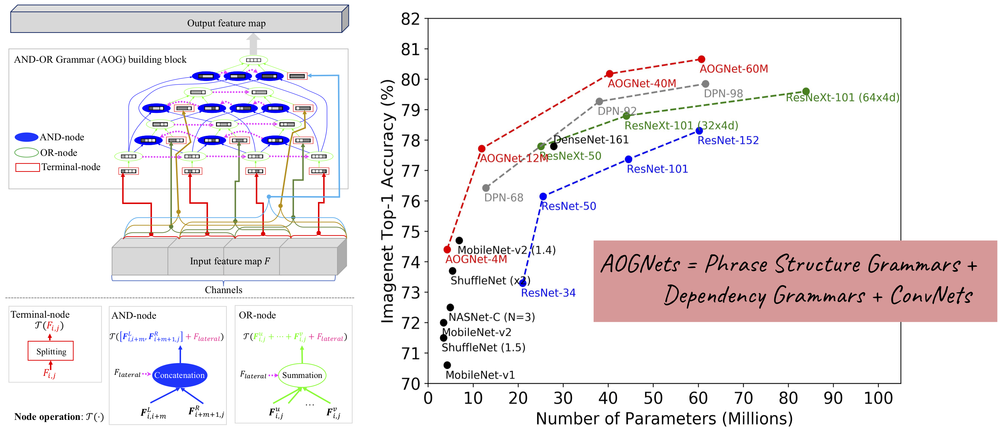

# AOGNets: Compositional Grammatical Architectures for Deep Learning

This project provides source code for our CVPR19 paper [AOGNets](https://arxiv.org/abs/1711.05847) and
an on-going work [Mixture Normalization: A Lightweight Integration of Feature Normalization and Attention]().
The code is still under refactoring. Please stay tuned for more.




## Installation

### Requirements

Ubuntu 16.04 LTS (althoug not tested, other OS should work too if PyTorch can be installed successfully)

Python 3 ([Anaconda](https://www.anaconda.com/) is recommended)

CUDA 9 or newer

PyTorch 0.4 or newer

NVIDIA [APEX](https://github.com/NVIDIA/apex)

NVIDIA [NCCL](https://docs.nvidia.com/deeplearning/sdk/nccl-install-guide/index.html).

### Clone the repo
```
$ git clone https://github.com/iVMCL/AOGNets.git
$ cd AOGNets
$ pip install requirements.txt
```

### Some tweaks

USE pillow-simd to speed up pytorch image loader (assume Anaconda is used)

```
$ pip uninstall pillow
$ conda uninstall --force jpeg libtiff -y
$ conda install -c conda-forge libjpeg-turbo
$ CC="cc -mavx2" pip install --no-cache-dir -U --force-reinstall --no-binary :all: --compile pillow-simd
```

## ImageNet dataset preparation

- Download the ImageNet dataset to YOUR_IMAGENET_PATH and move validation images to labeled subfolders
    - The [script](https://raw.githubusercontent.com/soumith/imagenetloader.torch/master/valprep.sh) may be helpful.

- Create a datasets subfolder under your cloned AOGNets and a symlink to the ImageNet dataset

```
$ cd AOGNets
$ mkdir datasets
$ ln -s PATH_TO_YOUR_IMAGENET ./datasets/
```

## Perform training on ImageNet dataset

NVIDIA Apex is used for FP16 training.

E.g.,

```
$ cd AOGNets
$ ./examples/train_fp16.sh aognet_s configs/aognet_imagenet_12M.yaml first_try
```

See more configuration files in AOGNets/configs. Change the GPU settings in train_fp16.sh


## Perform testing with pretrained models

- Pretrained [AOGNet_12M in ImageNet](https://drive.google.com/open?id=1MTPFR8C9tCXFNeYgn9NqZ3wOJt8ZeMm7) on Google Drive

- Pretrained [AOGNet_40M in ImageNet](https://drive.google.com/open?id=1t7gGiNcP8L6TSzLDHg8qcb8G_x-nlIfV) on Google Drive

- More coming soon

- Remarks: The provided pretrained models are obtained using the latest refactored code and the performance are slightly different from the results in the paper.

E.g.,

```
$ cd AOGNets
$ ./examples/test_fp16.sh aognet_s AOGNet_12M_PATH
```

## Citations
Please consider citing the AOGNets paper in your publications if it helps your research.
```
@inproceedings{AOGNets,
  author    = {Xilai Li and Xi Song and Tianfu Wu},
  title     = {AOGNets: Compositional Grammatical Architectures for Deep Learning},
  booktitle = {{IEEE} Conference on Computer Vision and Pattern Recognition, {CVPR}},
  year      = {2019},
  url       = {https://arxiv.org/pdf/1711.05847.pdf}
}
```

## Contact

Please feel free to report issues and any related problems to Xilai Li (xli47 at ncsu dot edu), Xi Song (xsong.lhi at gmail.com) and Tianfu Wu (twu19 at ncsu dot edu).

## License

AOGNets related codes are under [RESEARCH ONLY LICENSE](./LICENSE).
